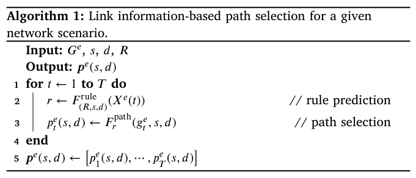

# A path selection method based on rule prediction in NTN
[Paper](https://www.sciencedirect.com/science/article/pii/S1389128624007904)

## 摘要
在後 5G/6G 時代，非地面網路 (NTN) 正在成為一種誘人的方法，以實現無所不在的連接，尤其是地面網路未覆蓋或服務不足的地區。

NTN 利用衛星和無人機作為網路節點，提供廣泛的空中覆蓋。
但這些移動節點會造成網路拓樸的變化，減少 NTN 與地面通訊的機會和時間。
天氣或太陽也會影響鏈路間的通訊品質，甚至斷連。

本文用鍊路資訊輸入 ML model 得到選路規則，再用這個規則來決定路徑。
這個模型是透過 NTN 模擬器產出的資料集進行訓練的。
在四個設想情境下的模擬結果表明，即使在惡劣天氣下，本方法在傳輸速度和穩定性均優於現有方法。

採用不同的選路方案能夠適應各種情況。

## 1. 前言
預計後 5G/6G 時代的網路將為所有區域提供連接，包括未覆蓋或服務不足的地區。
具體而言，這些網路除了要覆蓋需求密集的區域，還需要覆蓋海洋、大氣層、太空等稀少的區域。

因此，更有效率的網路基礎設施對於提供更廣泛的覆蓋非常重要，
而不僅僅是擴展現有的地面網路 (TN)，例如行動網路和固定網路。

### 非地面網路
非地面網路 (NTN) 正在成為一種很吸引人的廣泛的空中網路連接方法之一。

NTN 利用衛星、高空平台站 (HAPS)、無人機 (UAV) 做為三維空間中的飛行網路節點，例如基地台和路由器。

NTN 被認為是地面網路的補充，比地面網路能更有效的增強網路覆蓋。

儘管 NTN 可以有效擴大覆蓋範圍，但由於節點移動以及天氣等動態環境條件，難以維持穩定的通訊，因此 NTN 在維持高封包傳輸率方面面臨挑戰。
- 節點移動：LEO 以 7km/s 移動，對地面基站來說，只有約 10 分鐘的時間可見。
- 距離：衛星靠近地面站時會縮短距離，遠離時會拉長距離。
- 天氣：降雨或雲會影響通訊品質。

### 路徑選擇
在 NTN 中，考慮拓樸變化和鏈路可用性，在每個時刻選擇合適的路徑很重要。

現有的路徑選擇方法，包括 MANET 的路由協議，都依賴分散式路由，這涉及在網路內交換訊息以檢測拓撲變化，並計算路徑。

但這些分散式路由無法預測拓撲和天氣等環境條件的動態變化，難以在 NTN 中找到封包傳輸速率最優的路徑。

此外，現有的路由方法通常使用最短路徑演算法，但這個方法可能找不到路徑。
例如：若最短跳數路徑穿過暴雨地區，導致掉包率上升。 
若選擇另一條較長的路徑避開雨區，則可以提供較高的封包傳輸率。

所以需要一個方法來穩定 NTN-TN 之間的封包傳輸率。

### 機器學習預測路徑
本文提出了一種路徑選擇方法，基於機器學習 (ML)，利用鏈路資訊預測選路規則，來提高 NTN 傳輸率。

未來的鏈路資訊來自於軌道參數與天氣預報，而鏈路傳輸品質可以由傳播模型估計。

規則預測模型透過 NTN 模擬器產生的資料集進行訓練。

結果表明，每種選路規則都有助於封包的傳遞， 
與現有方法相比，選擇性地使用多種不同的選路規則可以提高封包傳輸率的穩定性。

## 2. 相關工作
略

## 3. 方法提出

### 3-1. 代號
| 符號 | 說明 |
| :- | :- |
| $e$ | 網路情境 (Network scenario) |
| $\mathcal{E}$ | 一組網路情境 |
| $T$ | 網路情境的持續時間 |
| $g_t^e$ | 在情境 $e$、時間 $t$ 的 NTN 拓樸， $g_t^e = (V,~ L,~ X^e(t))$ |
| $G^e$ | 在情境 $e$，時間 $t = 1 \sim T$ 的拓樸序列， $G^e = [~ g_1^e,~ g_2^e,~ \cdots ~,~ g_T^e ~ ]$ |
| $V$ | $g_t^e$ 中的節點集合， $V = \{ v_1,~ v_2,~ \cdots ~ \}$ |
| $L$ | $g_t^e$ 中的連結集合， $L = \{ l_1,~ l_2,~ \cdots ~ \}$ |
| $N$ | 連結資訊向量的維度 (參數的數量) |
| $x_{l_i}^e(t)$ | 在情境 $e$、時間 $t$，連結 $l_i$ 的資訊向量， $x_{l_i}^e(t) = [~ x_{l_i,~ 1}^e(t),~ x_{l_i,~ 2}^e(t),~ \cdots ~,~ x_{l_i,~ N}^e(t) ~]$， 這 $N$ 個參數有可能是頻寬、延遲、掉包率等等。 |
| $X^e(t)$ | 在情境 $e$、時間 $t$ 的所有連結資訊向量， $X^e(t) = \{ x_{l_1}^e(t),~ x_{l_2}^e(t),~ \cdots ~ \}$ |
| $s, d$ | 資料流的來源節點和目的節點 |
| $p_k$ | 從 $s$ 到 $d$ 的第 $k$ 條可能路徑， $p_k = [~ l_{k(1)}, ~l_{k(2)},~ \cdots ~] \in P$ |
| $P$ | 從 $s$ 到 $d$ 的所有可能路徑集合， $P = \{ p_1,~ p_2,~ \cdots ~ \}$ |
| $p_t^e(s,d)$ | 在情境 $e$、時間 $t$，從 $s$ 到 $d$ 被選路規則選取的路徑 |
| $p^e(s,d)$ | $p^e(s,d) = [ ~ p_1^e(s,d),~ p_2^e(s,d),~ \cdots ~,~ p_T^e(s,d) ~ ]$ |
| $r$ | 選路規則 |
| $R$ | 選路規則的集合 |
| $F_{(R,s,d)}^{\text{rule}}$ | 預測從 $s$ 到 $d$ 的選路規則的函數 |
| $F_r^{\text{path}}(g_t^e, s, d)$ | 在圖 $g_t^e$ 中，使用規則 $r$ 計算 $s$ 到 $d$ 路徑的函數 |

### 3-2. 架構
本文提出一種基於「連結資訊 $\to$ 選路規則 $\to$ 路徑」的方法，應用於 NTN。

下圖展示了在未來時間點 $1 \sim T$，基於連結資訊的路徑選擇架構：

該架構主要包含三個函數：
1. 計算連結資訊 (Link info calculation)
2. 基於連結資訊的規則預測函數 (Link info-based rule prediction)
3. 基於選路規則的路徑選擇器 (Rule-based path selection)

#### 計算連結資訊
連結資訊是一組連結特徵，例如：傳播損耗、傳播距離、位元錯誤率（BER）、以及其他指標。

在這個基於連結資訊的路由架構中，會根據未來的節點位置和環境的傳播損耗，來預測未來的連結資訊。

假設未來的節點位置可以利用軌道動力學，或是網路供應商提供的飛行器 (HAPS, UAV) 未來路徑來預測。

環境的傳播損耗則可使用一些傳播損耗模型計算，例如 ITU-R P.618-12 降雨損耗模型，輸入為節點位置與每個時間 $t$ 的天氣預測資料。

#### 基於連結資訊的規則預測函數
這是此架構的核心，基於連結資訊的規則預測函數 $F_{(R,s,d)}^{\text{rule}}$ 是一個基於機器學習的模型，能根據未來的連結資訊來預測合適的選路規則。

#### 基於選路規則的路徑選擇器
這是此架構的核心，會根據未來時間 $t \in [1, T]$ 的選路規則來選擇路徑，然後將這些路徑配置到 NTN 節點中，使來源節點的封包能沿著路徑傳送到目的節點。

#### 演算法

演算法 1 描述了在網路情境 $e$ 之下，如何選擇一條路徑。 
輸入：
- $G^e$，即未來的 NTN 網路拓樸 $g_1^e,~ g_2^e,~ \cdots ,~ g_T^e$，以及它們的連結資訊 $X^e(1),~ X^e(2),~ \cdots ,~ X^e(T)$。
- 來源節點和目的節點 $s$ 和 $d$。
- 集合 $R$，包含所有的選路規則。

函數 $F_{(R,s,d)}^{\text{rule}}$ 是一個基於機器學習的分類模型。
對於每個未來時間 $t \in [1, T]$：
1. 規則預測函數 $F_{(R,s,d)}^{\text{rule}}$ 會根據連結資訊 $X^e(t)$ 從集合 $R$ 之中挑選一個合適的選路規則 $r$。
2. 路徑計算函數 $F_r^{\text{path}}$ 根據選路規則 $r$ 計算一條從 $s$ 到 $d$ 的路徑 $p_t^e(s,d)$。

演算法輸出路徑序列 $p^e(s,d) = [ ~ p_1^e(s,d),~ p_2^e(s,d),~ \cdots ~,~ p_T^e(s,d) ~ ]$，並部署到 NTN。

### 3-3. 選路規則
路徑選擇是指在網路中，從來源節點到目的節點的所有可能路徑 $p_k$ 之中選出最佳的那條路徑。
選路規則定義為：
- 一個計算路徑的演算法
- 連結成本（路徑權重）

以連結參數作為輸入的路徑選擇器可表示為：
$$ \underset{p_k ~\in~ P}{\text{arg min}} \left( \sum_{l_i ~\in~ p_k} \text{cost}(l_i) \right) $$

若將 $\text{cost}(l_i)$ 定義為路徑 $p_k$ 的某一段連結 $l_i$ 的距離，並搭配最小權重路徑演算法， 
那麼這個選路規則就會選出一個最短路徑。

也可以考慮其他選路規則，例如設 $\gamma_{l_i}$ 為路徑 $p_k$ 的某一段連結 $l_i$ 的 $E_b/N_0$
( **Energy per bit** / **Noise power spectral density ratio** )，通訊強度/雜訊強度。 
將路徑選擇器設為：
$$ \underset{p_k ~\in~ P}{\text{arg max}} \left( \min_{l_i ~\in~ p_k} \gamma_{l_i} \right) $$

意思是，先求出每一條路徑之中最差的通訊品質，然後選一個「最差通訊品質」最高的路徑。

### 3-4. 規則預測模型
規則預測函數 $F_{(R,s,d)}^{\text{rule}}$ 會根據時刻 $t$ 的連結資訊 $X^e(t)$ 從集合 $R$ 之中挑選一個合適的選路規則 $r$。

這個函數是一個監督式學習訓練出的 $|R|$-分類器。

透過以下資料集來訓練這個模型： 
輸入：時刻 $t$ 的連結資訊 $X^e(t)$ 
輸出：時刻 $t$ 能夠從來源 $s$ 送至目的地 $d$ 的多個選路規則 $r$

訓練資料集是透過模擬多個網路情境 $e \in \mathcal{E}$ 產生的，每個場景都有不同的設置，以確保資料集涵蓋所有訓練標籤。

模型訓練演算法：

網路情境可以包括天線的指向與天氣，下表呈現了五種不同情況：

$※$ SNR (信噪比)、BER (Bit Error Rate)

## 4. 模擬
我們模擬了所提出的選路方法在 NTN 中的封包傳輸率，並與兩種現有方法 AODV 與 OLSR 做比較。

### 4-1. NTN 模擬場景

當衛星飛越日本時，Sat 1 是向資料中心 DC 發送資料的流量來源。 
表 3 列出了 NTN 中從 Sat 1 到 DC 的可能路徑：

就是排列組合而已。

每種選路方法都會在每個時刻，從 36 條路徑中選出一條。

如果天氣允許，可以選擇較近的一條。
如果某些地面站有強降雨，可以使用較遠的繞行路徑。

### 4-2. 連結資訊
| 代號 | 資訊 | 說明 |
| - | - | - |
| $x_{l_i,1}$ | Equivalent Isotropic Radiated Power (EIRP) 等效全向輻射功率 | 發射端天線等效在各方向平均的輸出功率，反映訊號強度。 |
| $x_{l_i,2}$ | Propagation Loss 傳播損耗 | 訊號在空間傳輸過程中的能量衰減（距離越遠損耗越大）。 |
| $x_{l_i,3}$ | Antenna Gain-to-Noise-Temperature (G/T) 天線增益與雜訊溫度比 | 衡量接收端天線的靈敏度（越大越好）。 |
| $x_{l_i,4}$ | $E_b/N_0$ 每位元能量與雜訊功率譜密度比 | 訊號能量與雜訊強度的比值，影響解碼正確率。 |
| $x_{l_i,5}$ | Bit Error Rate (BER) 位元錯誤率 | 傳輸中位元出錯的比例，反映鏈路可靠度。 |
| $x_{l_i,6}$ | Propagation Distance 傳播距離 | 訊號在連結中實際傳輸的距離。 |
| $x_{l_i,7}$ | Binary Link Availability 二元連結可用性 | 若節點間有連結則為 1，否則為 0。 |
| $x_{l_i,8}$ | Binary Link Attribute 二元連結屬性 | 連結是 ISL 還是衛星–地面站鏈路。 |

本次模擬引入了三種選路規則

### 4-3. 訓練和模擬網路情境
我們考慮了 35 個訓練情境 (記為 T1 到 T35)，在 $t \in [1, 600]$ (秒) 的時間區間對 NTN 進行模擬，並取得訓練集。

這些網路情境彼此之間的差異在於：
- 衛星天線與地面基站通訊時的指向設定 (Sat $\to$ GS)
- 地面基站天線與衛星通訊時的指向設定 (GS $\to$ Sat)

因此，訓練資料集包含了不同的鏈路資訊與標籤。

在預設的 NTN 模擬之下， 
所有 Sat $\to$ GS 天線都為啟用狀態，並垂直向下指向，記為 ↓。 
所有 GS $\to$ Sat 天線都為啟用狀態，並指向 Sat 1。垂直向上的 GS $\to$ Sat 天線以符號 ↑ 表示，

所有訓練情境均在良好的天氣條件下進行，無降雨區域。

每個訓練情境的設定如表 6 顯示：

透過這些情境的模擬，分別從規則 1, 2, 3 獲得了 10383, 9817, 1193 筆資料，接著將它們隨機欠取樣各取 1193 筆，共 3579 筆資料。 
基於該資料集，使用 `sk-learn` 的隨機森林訓練了規則預測模型 $F_{(R,s,d)}^{\text{rule}}$，準確率達 0.92。 
注意：本研究的評估指標為封包傳遞率，準確率僅供參考。

注意：模擬情境 (測試集) 並不包含在訓練集內，並且訓練集並不包含降雨區域。

如下圖，600s 的模擬時間被劃分為 3 個部分：

- (a) 因為天氣良好，Sat 1 可以直接跟 GS 1 或 GS 2 通訊。
- (b) 當 Sat 1 通過降雨區域時，與部分 GS 通訊變得困難，但可以透過 Sat 2 進行通訊。
雖然這條路徑比較遠，但繞開降雨區域可以提高 SNR。
- (c) 大部分衛星已經通過降雨區並到達東部地區，因此 Sat 1 通往 DC 的高品質路徑與前兩部分不同。

因此，選路方法在每一時段都變得關鍵，以確保高封包傳送率。 

### 4-4. 模擬環境
使用以下模擬工具：
- STK v12.5 Pro：模擬無線訊號傳播，包括 rain loss。
- EXata v7.3.2：模擬封包層級的網路。

訓練集：無雨，僅使用 free space loss 計算連結資訊。 
測試集：有雨，在 free space loss 額外加上 rain loss，測試泛化能力。

### 4-5. 結果
將目前的方法與現有的 AODV 與 OLSR 做比較。

#### 封包傳遞率
封包傳送率 (PDR) 的總體結果 (每個評估情境的三個部分)

下表每一個封包傳遞率，分母均為 20,000 個封包。

**Evaluation scenario 1：**  
| Part  | Proposed | AODV | OLSR |
| -     | -        | -    | -    |
| 1     | 0.98     | 0.94 | 0.90 |
| 2     | 0.99     | 0.99 | 0.76 |
| 3     | 0.95     | 0.20 | 0.41 |
| avg | 0.98     | 0.71 | 0.69 |

**Evaluation scenario 2：**  
| Part  | Proposed | AODV | OLSR |
| -     | -        | -    | -    |
| 1     | 0.87     | 0.99 | 0.89 |
| 2     | 0.98     | 0.97 | 0.73 |
| 3     | 0.99     | 0.67 | 0.89 |
| avg | 0.93     | 0.88 | 0.70 |

**Evaluation scenario 3：**  
| Part  | Proposed | AODV | OLSR |
| -     | -        | -    | -    |
| 1     | 0.99     | 0.99 | 0.90 |
| 2     | 0.99     | 0.99 | 0.82 |
| 3     | 0.63     | 0.53 | 0.61 |
| avg | 0.87     | 0.84 | 0.78 |

**Evaluation scenario 4：**  
| Part  | Proposed | AODV | OLSR |
| -     | -        | -    | -    |
| 1     | 0.99     | 0.99 | 0.91 |
| 2     | 0.99     | 0.99 | 0.91 |
| 3     | 0.91     | 0.99 | 0.41 |
| avg | 0.97     | 0.99 | 0.69 |

- 情境 1, 2, 3 明顯高於 AODV、OLSR，情境四約等於 AODV、優於 OLSR。 
在大多數情境下比現有方法好，至少能勝過其中一個現有方法。
- 提出的方法幾乎都能保持 90 % 以上的傳遞率，而 AODV、OLSR 在某些部分非常糟糕。
- 提出的方法在情境 3 因為 Sat 5 連結品質較好，導致所有地面站都指向 Sat 5，因此掉到 ~ 60 %。

特點：
- AODV：依賴的路徑數量少，如果一些路徑失效，PDR 會掉很多。
- OLSR：擁有較多路徑資訊，即使部分失效，還能維持一定 PDR，但平均 PDR 較低。
- 提出的方法：使用規則預測模型，在不同情境下採用不同策略，表現穩定、能維持一致且高的 PDR。

行為模式：
- AODV：當需要傳輸時才開始尋找路徑，一但關鍵的路徑失效，PDR 會降得很低。
- OLSR：會同時用「多條路徑」，而且大多是 two-hop，比 AODV 更可靠。
不過很少選擇 Sat-GS 的直接路徑，因此稍差。

| 協定 | 類型 | 尋路方式 |
| - | - | - |
| AODV | Reactive | 需要傳輸時才找路徑 |
| OLSR | Proactive | 持續廣播 Hello + TC 訊息，維護全網拓樸 |

Proposed method 的優勢：

